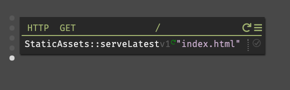

This project was bootstrapped with [Create React App](https://github.com/facebook/create-react-app) and modified with scripts for building and uploading for [darklang](https://darklang.com).

## Clone the repo
`git clone git@github.com:aashanand/react-dark-starter.git`

`cd react-dark-starter`

## Set Environment Variables

To start, first set up some environment variables.

`export DARK_STATIC_ASSETS_BASE_URL='replace-with-your-canvas-name';`

`export DARK_USERNAME='replace-with-your-dark-username';`

`export DARK_PASSWORD='replace-with-your-dark-password';`

Then, there are just four more steps before you're in business.

## Install modules

`npm install`

## Special build command

`npm run build-dark-assets`

## Get Dark CLI
You only need to do this once per project. Every other time, you can skip to the next step.

`npm run get-dark-cli`

## Deploy to Dark

`npm run deploy`

If you get "Not Found" on this step, you need to visit [https://darklang.com/a/USERNAME-CANVASNAME](https://darklang.com/a/USERNAME-CANVASNAME) first in your browser.

## Serve from Dark

1. Go to [https://darklang.com/a/USERNAME-CANVASNAME](https://darklang.com/a/USERNAME-CANVASNAME)
2. Create a new `HTTP GET` handler with route `/`
3. For the expression, use `StaticAssets:serveLatest` -> `"index.html"`

## Demo
Demo lives [here](https://aash-react-dark-starter.builtwithdark.com/).

Demo image below.

